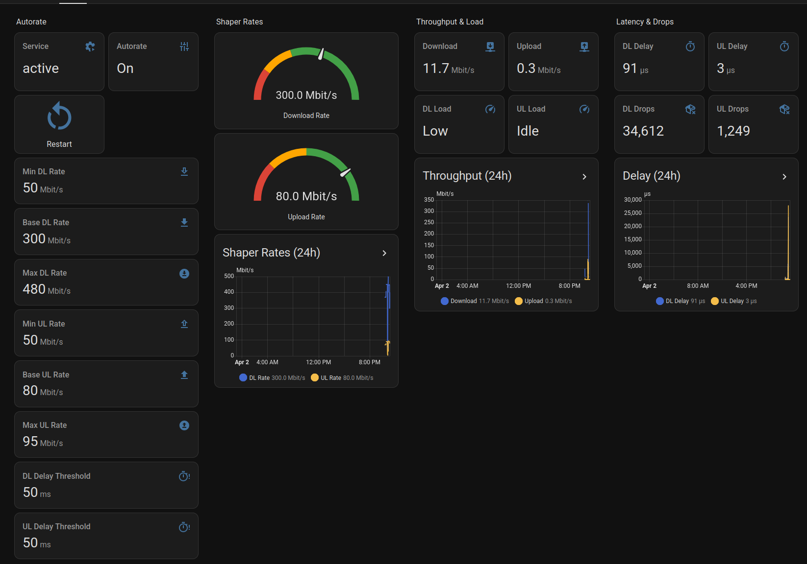

# CAKE QoS — Home Assistant Integration

Monitor and control a [CAKE](https://www.bufferbloat.net/projects/codel/wiki/Cake/) QoS bridge from Home Assistant.

Designed for a transparent L2 bridge with [cake-autorate](https://github.com/lynxthecat/cake-autorate) running on a Proxmox LXC. Communicates with a lightweight HTTP exporter running on the bridge host.

---

## Architecture

```
LAN clients
    │
    ▼
 eth1 [CAKE↓ — download shaper]
    │
  br0  ◄── cake-stats-exporter :9101
    │
 eth0 [CAKE↑ — upload shaper]
    │
    ▼
OPNsense LAN NIC → WAN
```

All LAN traffic passes through the bridge. CAKE shapes download on `eth1` (toward clients) and upload on `eth0` (toward the router). `cake-autorate` continuously adjusts rates based on measured OWD latency.

---

## Dashboard



---

## Requirements

- Home Assistant 2024.1+
- HACS
- The [cake-stats-exporter](#server-setup) running on your bridge host

---

## Server Setup

The exporter lives in [`server/`](server/). Deploy it to your bridge LXC:

### Prerequisites

```bash
# On the bridge LXC (or wherever CAKE runs)
apt-get install -y python3 iproute2
mkdir -p /var/lib/cake-stats
```

### Deploy

```bash
# Copy files
cp server/cake-stats-exporter.py /usr/local/bin/cake-stats-exporter.py
cp server/apply-cake.sh /usr/local/bin/apply-cake.sh
chmod +x /usr/local/bin/apply-cake.sh

# Install systemd service
cp server/cake-stats-exporter.service /etc/systemd/system/
systemctl daemon-reload
systemctl enable --now cake-stats-exporter.service
```

Edit `LISTEN_ADDR` in `cake-stats-exporter.py` to match your bridge IP.

### API

| Method | Path | Description |
|--------|------|-------------|
| GET | `/stats` | Full stats (tc + autorate + service state + static rates) |
| GET | `/health` | Liveness check |
| GET | `/config` | Current autorate config values |
| GET | `/cake/rates` | Persisted static rate settings |
| POST | `/autorate/start` | Start cake-autorate service |
| POST | `/autorate/stop` | Stop cake-autorate service |
| POST | `/autorate/restart` | Restart cake-autorate service |
| POST | `/config` | Update autorate config (JSON body) |
| POST | `/cake/rates` | Set static rates (`dl_rate_mbit`, `ul_rate_mbit`) |

---

## Installation (HACS)

1. Add this repository as a custom HACS integration repository
2. Install **CAKE QoS** from HACS
3. Restart Home Assistant
4. Go to **Settings → Devices & Services → Add Integration → CAKE QoS**
5. Enter the exporter host (default: `192.168.8.241`) and port (default: `9101`)

---

## Entities

### Sensors (17)

| Entity | Description | Unit |
|--------|-------------|------|
| Download shaper rate | Live CAKE bandwidth from `tc` (ground truth) | Mbit/s |
| Upload shaper rate | Live CAKE bandwidth from `tc` (ground truth) | Mbit/s |
| Download achieved | Autorate measured throughput | Mbit/s |
| Upload achieved | Autorate measured throughput | Mbit/s |
| Download load | Load condition (Idle / Low / Waiting / High) | — |
| Upload load | Load condition (Idle / Low / Waiting / High) | — |
| Download delay | CAKE tin avg queue delay | µs |
| Upload delay | CAKE tin avg queue delay | µs |
| Download latency delta | OWD delta from autorate | µs |
| Upload latency delta | OWD delta from autorate | µs |
| Download drops | CAKE drop counter | — |
| Upload drops | CAKE drop counter | — |
| Download sparse flows | CAKE flow count | — |
| Download bulk flows | CAKE flow count | — |
| Download bandwidth | Raw tc bandwidth_mbit (diagnostic) | Mbit/s |
| Upload bandwidth | Raw tc bandwidth_mbit (diagnostic) | Mbit/s |
| Autorate service | systemd service state | — |

### Switch (1)

| Entity | Description |
|--------|-------------|
| Autorate | Start/stop cake-autorate. Turning off applies the persisted static rates. |

### Numbers (8)

| Entity | Description | Unit |
|--------|-------------|------|
| Min download rate | Autorate minimum DL boundary | Mbit/s |
| Base download rate | Autorate starting DL rate | Mbit/s |
| Max download rate | Autorate maximum DL boundary | Mbit/s |
| Min upload rate | Autorate minimum UL boundary | Mbit/s |
| Base upload rate | Autorate starting UL rate | Mbit/s |
| Max upload rate | Autorate maximum UL boundary | Mbit/s |
| Download delay threshold | OWD delta that triggers rate reduction | ms |
| Upload delay threshold | OWD delta that triggers rate reduction | ms |

Changing an autorate number entity automatically restarts cake-autorate to apply the new config.

### Static rate numbers (2)

Shown on the dashboard only when autorate is **off**:

| Entity | Description | Unit |
|--------|-------------|------|
| Static download rate | Fixed CAKE DL rate | Mbit/s |
| Static upload rate | Fixed CAKE UL rate | Mbit/s |

### Button (1)

| Entity | Description |
|--------|-------------|
| Restart autorate | Force restart cake-autorate service |

---

## Notes

- Poll interval: 10 seconds (DataUpdateCoordinator)
- Shaper rate sensors read directly from `tc` qdisc stats — not from autorate log — so they always reflect the currently applied rate
- Static rates are persisted to `/var/lib/cake-stats/static-rates.json` on the bridge host
- `apply-cake.sh` uses `tc qdisc replace` — safe to run while the bridge is active
